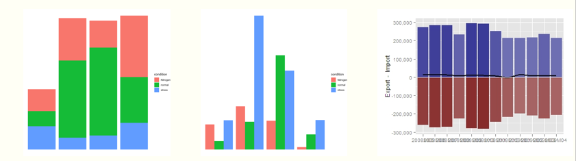
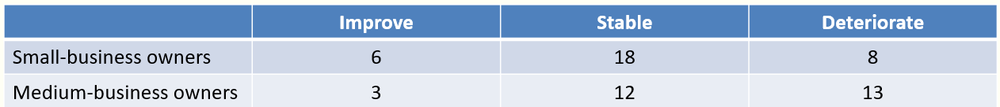

## Data science week 5

**_Populations and Samples_**

-   Population: the entire set of possible cases
-   Sample: a subset of the population from which data are collected
-   Parameter: a measure concerning a population, e.g. population mean
-   Statistic: a measure concerning a sample, e.g. sample mean

**_Two categorical variables_**

Examples

Frequence table

> For data analyst it is good to draw pictures/plots so you can visualize
